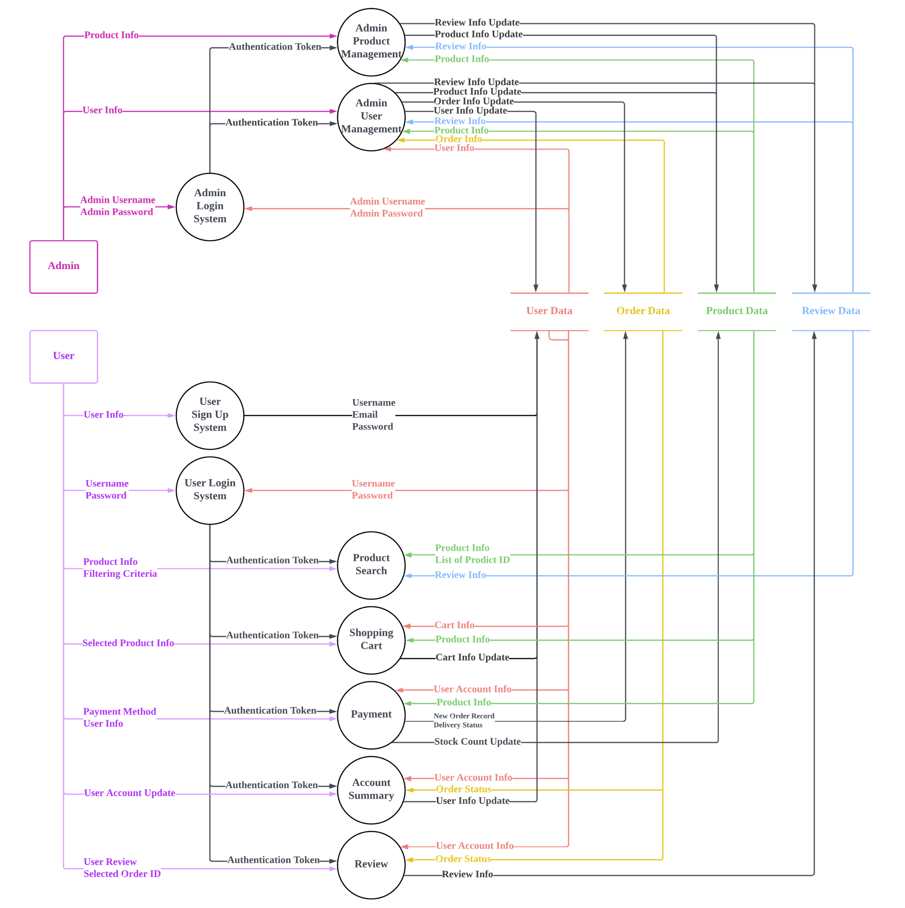
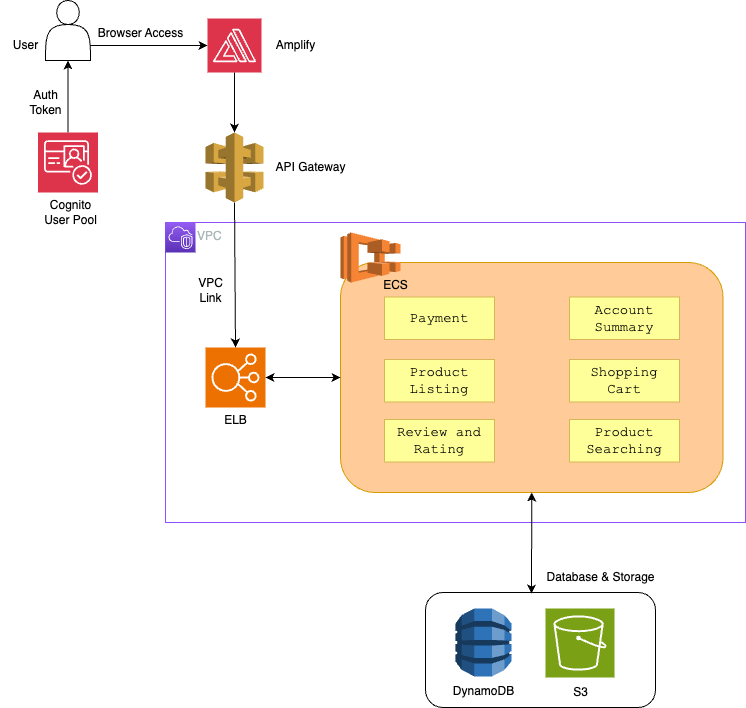

#### **Motivation**
This is a group project from a course in CUHK, where we created a full-stack online shopping platform.\
Our team outperformed other teams, attaining the ***highest*** score among all.

We developed our application in different phase.\
Just like all other software, we didn't dive right into the development, we planned and designed different documents beforehand.
###### 1. High Level Design
###### 2. DFD Specification
###### 3. UML Design and UI Design
###### 4. Development

 
After the development, we deployed the application to `AWS` with `Docker`,
together with Infrastructure as Code with `Terraform`.

 

#### **Role**
I am the **full stack developer** and the **UI designer** in the team.\
Focusing mainly on the backend services with `Spring Boot` and `DynamoDB` and the frontend development with `SvelteKit`.

 

#### **Description**
The goal of this project is to create an online shopping platform for footwear – 9Kicks.

Besides the online platform, we also created a inventory and user management system for admin.

There are mainly 2 user groups:
1. User
    1. Search for specific products, apply search conditions
    2. Add / Remove products to/from cart
2. Admin
    1. View / Add / Delete users
    2. View / Add / Delete products

We also developed additional features
1. Purchase items via Stripe API
2. Order tracking for the purchase
3. Recommendation system based on users
4. Product review and rating