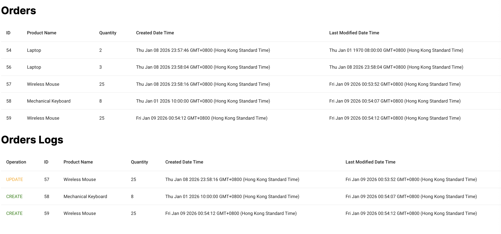

#### **Motivation**
This project aims to test out how to integrate `Debezium`, `Kafka` and `Spring Boot` all together.

We all have experienced where we wanted to keep track of the changes in the database, but polling doesn't sound right, it is wasting resources and ineffecient. Change Data Capture (CDC) is the solution, where changes from the database is picked up and published to the MQ for the services to further process the changes.

The following project simulate a simple ordering system, any `create`, `update`, `delete` of records will be captured by `Debezium` and published to `Kafka`.

#### **Description**
`Orders` is showing the latest orders \
`Orders Logs` is showing the history of changes in the database table

#### **Demo**

The following video shows how the changes in database is monitored by `Debezium`, published to `Kafka`, pushed to `Spring Boot`, and finally streamed to `Angular` via Websocket

#### **Docker container services and ports**

**debezium/zookeeper:2.5** [:2181, :2888, :3888] Standard Zookeeper tailored for Debezium/Kafka setups

**debezium/kafka:2.5** [:9092 (for inside docker), :9093 (for outside docker)] Apache Kafka image customized for Debezium workflows

**debezium/connect:2.5** [:8083] Kafka Connect base pre-loaded with all official Debezium connectors

**postgres:15** [:5432] Database

#### **Local machine services and ports**

**Spring Boot** [:8088]

**Angular** [:4200]
