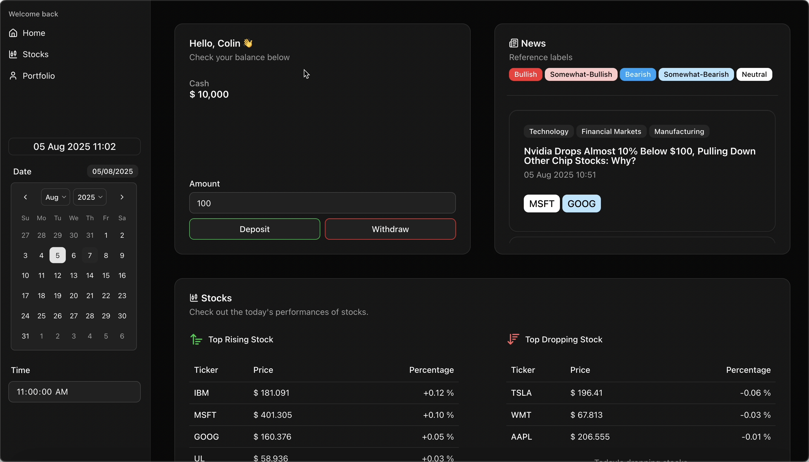
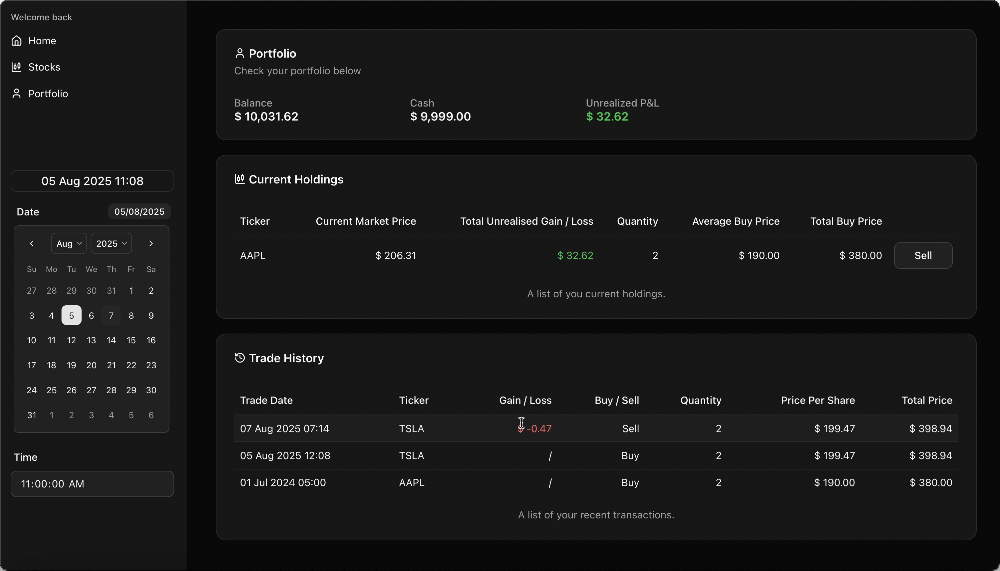

#### **Motivation**
This is a group project from a course in the training program of Nomura, where we created a full-stack straight through processing system for users to mimic executing trades.

Our project was given very limited initial guidance, and requiring us to independently explore different methodologies ourselves.

Our development timeline was also really packed, we were only given around a little more than 10 hours officially in total to complete the entire project.

Given most team members had limited prior knowledge of finance, it was particular challenging to fully understanding and
deliver a quality outcome within such a constrained timeframe.

#### **Role**
I am the **full stack developer** and the **UI designer** in the team.\
Focusing mainly on the backend services with `Spring Boot` and `PostgreSQL` and the frontend development with `Next.js`.

 

#### **Description**
The goal of this project is to create a real-time straight-through processing system.

Features:

1. Home Page
    1. View their balance and cash
    2. Deposit and withdraw cash
    3. Read recently news related to the market
    4. Read Top Rising and Top Dropping Stocks for the day

2. Stock Page
    1. Choose different ticker and view real-time price
    2. Execute trade in market price

3. Portfolio Page
    1. Read real-time unrealized P&L and realized P&L
    2. View and sell current holdings
    3. View trade history

Because this is a simulation of the real market, users can also choose different time and date to simulate different point of time to view the market.
